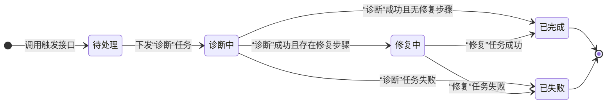

### 工作流状态列表

1.  **`pending` (待处理)**
    *   **含义:** API已接收请求，工作流记录已创建，等待下发第一个任务。
    *   **触发:** 调用 `TriggerKB` 接口。

2.  **`diagnosing` (诊断中)**
    *   **含义:** "诊断"任务已下发，等待Agent执行并返回结果。
    *   **触发:** `StartKBWorkflow` 函数成功下发诊断任务。

3.  **`remediating` (修复中)**
    *   **含义:** "修复"任务已下发，等待Agent执行并返回结果。
    *   **触发:** 诊断成功，且知识库中存在修复步骤。

4.  **`completed` (已完成)**
    *   **含义:** 所有步骤成功执行，工作流正常结束。
    *   **触发:** (诊断成功且无修复步骤) 或 (修复成功)。

5.  **`failed` (已失败)**
    *   **含义:** 任意步骤执行失败，工作流异常终止。
    *   **触发:** 诊断失败或修复失败。

---

### 工作流状态流转图

*(注：`direction LR` 表示流程图从左到右绘制，更符合阅读习惯)*

**图解:**
*   `[*]` 代表流程的开始和结束点。
*   整个流程由“调用触发接口”启动，进入“待处理”状态。
*   核心逻辑围绕着“诊断中”和“修复中”两个状态进行转换。
*   无论流程如何进行，最终都会进入“已完成”或“已失败”这两个终点状态之一。